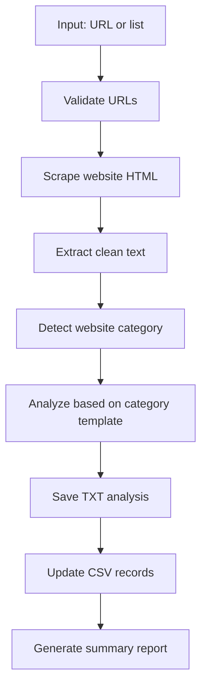

# Website Analyzer Documentation (Please use mac to run the code)

<div align="center">
<h3>A comprehensive tool for automated website analysis and categorization</h3>
</div>

---

## Table of Contents

1. [Introduction](#introduction)
2. [System Architecture](#system-architecture)
3. [Core Components](#core-components)
   - [Main Interface (main.py)](#1-main-interface-mainpy)
   - [URL Processing (processor.py)](#2-url-processing-processorpy)
   - [Website Scraping (scraper.py)](#3-website-scraping-scraperpy)
   - [Content Analysis (analyzer.py)](#4-content-analysis-analyzerpy)
   - [File Management (file_handler.py)](#5-file-management-file_handlerpy)
   - [CSV Export (export_csv.py)](#6-csv-export-export_csvpy)
   - [Utility Functions (utils.py)](#7-utility-functions-utilspy)
   - [Configuration (config.py)](#8-configuration-configpy)
4. [Workflow](#workflow)
5. [Use Cases](#use-cases)
6. [Technical Notes](#technical-notes)

---

## Introduction

Website Analyzer is a powerful Python-based tool that automates the process of analyzing websites by scraping content, intelligently categorizing pages, and extracting relevant information using AI. The system supports both single URL and batch processing capabilities, with results stored in both raw text and structured CSV formats.

---

## System Architecture

The tool follows a modular design with clear separation of concerns:

```
┌─────────────┐     ┌──────────────┐     ┌───────────────┐     ┌─────────────┐
│  Main UI    │────▶│URL Processing│────▶│Website Scraper│────▶│AI Analyzer  │
└─────────────┘     └──────────────┘     └───────────────┘     └─────────────┘
                                                                      │
┌─────────────┐     ┌──────────────┐     ┌───────────────┐            │
│CSV Export   │◀────│File Handler  │◀────│Cache Manager  │◀───────────┘
└─────────────┘     └──────────────┘     └───────────────┘
```

---

## Core Components

### 1. Main Interface (main.py)

The entry point that provides a command-line interface with four primary functions:

| Function | Description |
|:---------|:------------|
| `main()` | Provides CLI menu for all operations |
| `export_all_txt_to_csv()` | Batch converts all TXT analyses to CSV format |

**Capabilities:**
- Single URL analysis with detailed feedback
- Batch processing from input file
- Cache management
- Export functionality for existing analyses

---

### 2. URL Processing (processor.py)

Orchestrates the complete website analysis workflow:

| Function | Description |
|:---------|:------------|
| `process_url()` | End-to-end processing of a single URL |
| `batch_process_urls()` | Concurrent processing of multiple URLs |
| `process_single_url()` | Interactive processing with real-time feedback |

**Capabilities:**
- URL validation and normalization
- Exception handling at each processing stage
- Multithreaded batch processing with progress tracking
- Detailed success/failure reporting
- Performance timing metrics

---

### 3. Website Scraping (scraper.py)

Handles the content acquisition and extraction:

| Function | Description |
|:---------|:------------|
| `scrape_website()` | Retrieves HTML content from a URL |
| `extract_main_content()` | Cleans and extracts text from HTML |

**Capabilities:**
- Realistic user agent simulation
- Exponential backoff retry mechanism
- Content filtering (removes scripts, styles, navigation elements)
- Configurable timeouts and retry settings
- Text length optimization for efficient processing

---

### 4. Content Analysis (analyzer.py)

Leverages AI for categorization and analysis:

| Function | Description |
|:---------|:------------|
| `check_category_cache()` | Retrieves cached categorization if available |
| `save_category_cache()` | Stores categorization results |
| `detect_category()` | Determines website category using AI |
| `analyze_with_ollama()` | Performs detailed content analysis |

**Capabilities:**
- Intelligent website categorization
- Category-specific analysis templates
- Caching system for efficient processing
- Support for streaming and non-streaming responses
- Structured prompting for consistent analysis format

---

### 5. File Management (file_handler.py)

Manages storage and organization:

| Function | Description |
|:---------|:------------|
| `create_folders()` | Initializes directory structure |
| `save_analysis_to_file()` | Stores analysis results |
| `save_batch_results()` | Creates batch summary report |
| `clean_cache()` | Removes expired cache files |

**Capabilities:**
- Organized file structure by category
- Safe filename generation from URLs
- Dual-format storage (TXT and CSV)
- Cache expiration management
- Batch summary reporting

---

### 6. CSV Export (export_csv.py)

Handles structured data output:

| Function | Description |
|:---------|:------------|
| `create_csv_files()` | Initializes CSV files with headers |
| `parse_analysis()` | Extracts structured data from analysis text |
| `extract_analysis_text()` | Isolates analysis content from metadata |
| `append_to_category_csv()` | Updates CSV records with new analyses |

**Capabilities:**
- Dynamic header generation from analysis templates
- Structured data extraction from text
- Consistent CSV formatting
- Handles multi-line responses in structured format

---

### 7. Utility Functions (utils.py)

Provides support functionality:

| Function | Description |
|:---------|:------------|
| `check_dependencies()` | Verifies required libraries |
| `validate_url()` | Validates and normalizes URLs |
| `sanitize_filename()` | Creates safe filenames |
| `get_filename_from_url()` | Generates filenames from URLs |
| `is_cache_expired()` | Checks cache freshness |
| `read_urls_from_file()` | Loads URLs from text files |

**Capabilities:**
- Dependency verification
- URL validation and normalization
- Secure filename handling
- Multi-encoding file reading
- Cache expiration checking
- Comment handling in input files

---

### 8. Configuration (config.py)

Defines system-wide settings:

| Setting | Description |
|:--------|:------------|
| `CATEGORIES` | Website categories and analysis templates |
| `MAX_TEXT_LENGTH` | Text length limit for efficiency |
| `MAX_WORKERS` | Number of concurrent processing threads |
| `CACHE_DIR` | Cache storage location |
| `USE_STREAMING` | Toggle for streaming responses |
| `MODEL_NAME` | Ollama model specification |
| `CACHE_EXPIRY_DAYS` | Cache freshness period |

**Analysis Categories:**
- Technology
- News
- Sports
- E-commerce
- Finance
- Education
- Healthcare
- Travel
- Food
- Entertainment
- Default

---

## Workflow



1. **Input**: URL or list of URLs provided by user
2. **Validation**: Normalize and validate URL structure
3. **Scraping**: Extract HTML with retry mechanism
4. **Text Extraction**: Clean and optimize content
5. **Categorization**: Determine website category via AI
6. **Analysis**: Generate structured insights using category templates
7. **Storage**: Save results in both TXT and CSV formats
8. **Reporting**: Provide summary of processed URLs

---

## Use Cases

- **Content Auditing**: Analyze multiple websites for specific information
- **Competitive Analysis**: Extract key details from competitor websites
- **Market Research**: Gather structured data across industry websites
- **Data Collection**: Automate extraction of specific information across websites
- **Website Categorization**: Automatically classify websites by content type

---

## Technical Notes

- **AI Integration**: Uses Ollama AI service for text analysis
- **Performance Optimization**:
  - Implements caching to reduce API calls
  - Uses multithreading for efficient batch processing  
  - Limits text length to reduce processing time
- **Error Handling**:
  - Network retry logic with exponential backoff
  - Graceful degradation for parsing failures
  - Detailed error reporting
- **Output Formats**:
  - Raw text (TXT) for detailed analysis
  - Structured data (CSV) for data processing
  - Summary reports for batch operations

## Areas for Improvement
- Use Beautiful Soup to scrape website (Unable to scrape dynamically laoded webpages)
- Requires large computation power due to big the usage of a big ollama model. --> Can try optimise code slightly better
- Big ollama model has to be used to ensure accurate structured output
